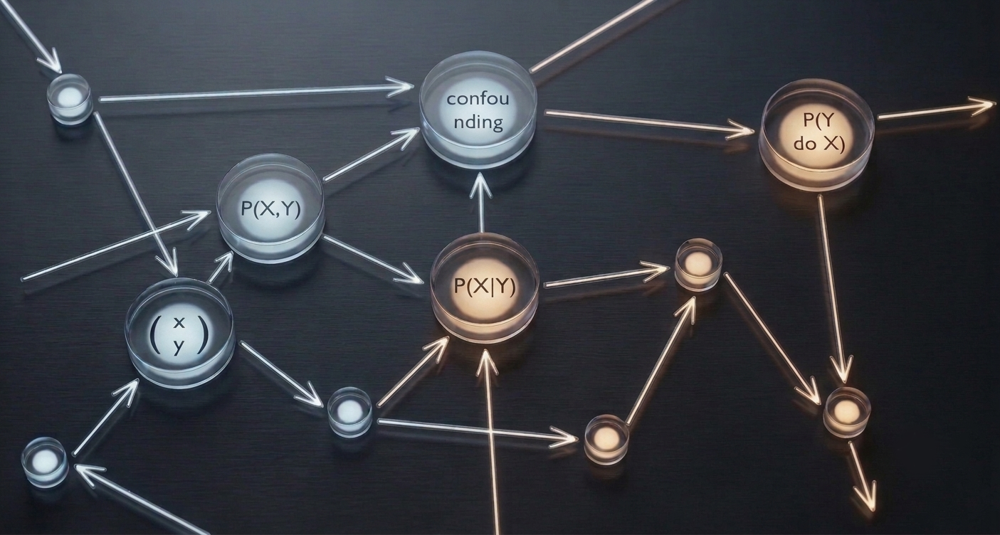
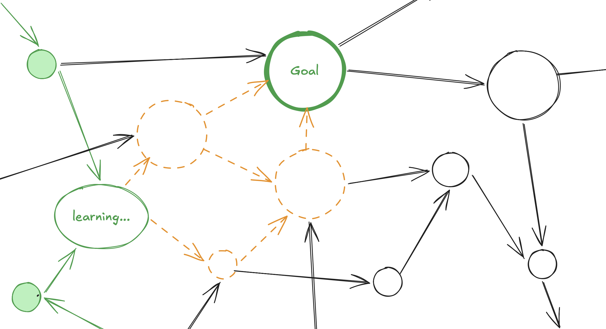
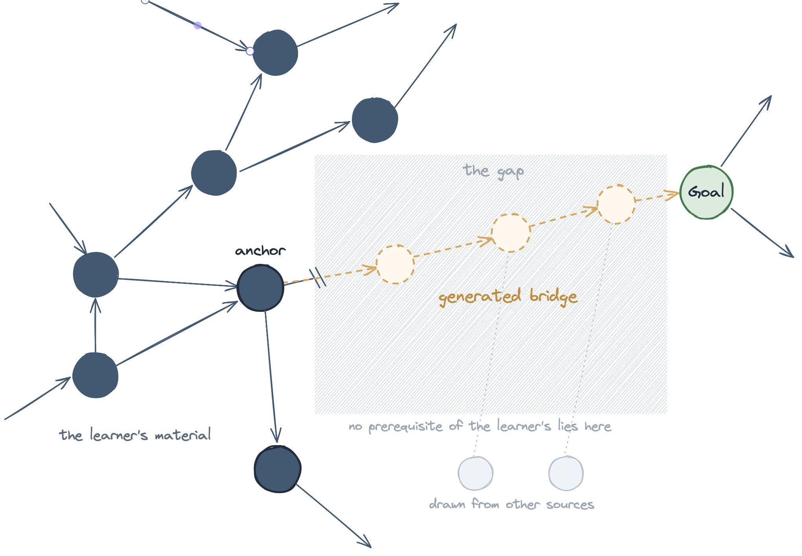

For a while now I have been working on a way to treat curriculum design as a planning problem, and because the formal write-up still needs a good deal of work and a set of experiments before it is ready, I want to use this post to introduce the idea itself, the body of work it rests on, and the platform I have in mind for it.

The starting observation is the one from my earlier notes, that any topic worth learning sits on top of other topics, so that causal calculus presupposes probability theory, which in turn rests on algebra, measure theory, and logic, and this layering is not incidental decoration around the material but is the actual structure of it. Once that structure is written down as a graph whose nodes are topics and whose edges record which topic depends on which, the question a student is really asking, namely what they should learn next, becomes something one can compute an answer to rather than something fixed in advance by the order of chapters in a book.

## Building on Knowledge Space Theory

The idea that knowledge has a structure one can reason about formally is not new, and the work I am doing builds directly on a tradition called [Knowledge Space Theory](https://doi.org/10.1016/S0020-7373%2885%2980031-6) (KST), developed by Jean-Paul Doignon and Jean-Claude Falmagne in the 1980s, which models a subject as the family of knowledge states a learner can actually occupy, where each state is a set of mastered topics consistent with the prerequisites, and where, for any state the learner is in, the theory identifies the topics they are now ready to study, which it calls the fringe. That fringe is a formal cousin of an older pedagogical idea, [Vygotsky's Zone of Proximal Development](https://en.wikipedia.org/wiki/Zone_of_proximal_development), the band of material just beyond what a learner can already do alone, where instruction does the most good, and the practice of teaching in small supported steps within that band is what educators call scaffolding. This tradition is not merely academic, since it underlies [ALEKS](https://www.aleks.com), a system used by a great many students, which locates a learner's knowledge state in a few dozen well-chosen questions and then recommends what to work on from there.

Where my work departs from that tradition is in its purpose, because knowledge space theory was built largely to assess a learner, that is to locate efficiently which state they are in, whereas I am interested in what happens once that state is known and the material the learner has brought turns out to be incomplete. The structure recovered from a student's own material will often have gaps, places where a prerequisite the goal depends on is simply absent from what was provided, so that no study sequence the structure permits actually reaches the goal, and it is precisely there that the planning, the knowledge-state classification, and the rest of the machinery earn their place, since their purpose is not merely to choose among the routes that exist but to detect where the route runs out and to generate, dynamically, the curriculum that bridges the missing span. The ground truth the learner provides becomes the anchor the platform abseils from, the fixed point around which it builds a bridge across the gap, drawing the contents it needs from other sources to close it. That shift turns a map of which states are reachable into an active plan that says, from wherever the learner happens to be, which single step brings the goal closest, and that builds the step itself when the material does not already contain it.

To make that bridging precise rather than a matter of intuition, I want to place a measure over the latent space in which the topics are embedded, one that quantifies how far apart two nodes lie, and my hypothesis is that the distance between the material on either side of a gap is what governs how much has to be built to span it. I expect a small gap to be closed by a single intermediate step, whereas a wide one, where the prerequisite the learner is missing sits far from anything they already hold, would have to be filled with a whole chain of generated nodes, each of them a little out of the distribution of the original material, before the goal comes within reach. The aim throughout is to keep the steps small, bridging even a wide gap not with one implausible leap but with a sequence of short and individually masterable moves, because the more distant the endpoints the more new material the system must generate to connect them, and material generated far out of distribution is precisely the material a learner is least equipped to absorb.

## What to learn, rather than how to learn

It helps to separate two questions that are easy to run together. The first is what a learner should study next, given _what_ they already know and where they are trying to get to, and the second is _how_ a particular learner learns, meaning how quickly they absorb new material, the characteristic ways in which they go wrong, and how fast they forget. Both questions are legitimate and each has its own literature, but they are genuinely different problems, and this work is about the first of them.

I make that choice deliberately, holding the model of how a person learns fixed and simple, and putting the effort instead into the structure of the subject and the route through it. There is an active and complementary line of research that does the opposite, of which the [homomorphic POMDP work of Gao et al.](https://arxiv.org/abs/2403.10930) is a recent example, where the system infers the learner's cognitive pattern, meaning the rate and manner in which they learn, while keeping the representation of the subject deliberately small. The two efforts are not in competition so much as they address orthogonal halves of the same picture, and a system that eventually personalised both what a learner studies and how their learning is modelled, over a structured subject, would be the natural place where the two meet.

## The work that predates this

The approach draws several existing threads together rather than inventing them. Estimating what a learner knows from their performance is the subject of Knowledge Tracing, which goes back to [Corbett and Anderson in 1994](https://link.springer.com/article/10.1007/BF01099821) and has since been carried into modern machine learning under the name [Deep Knowledge Tracing](https://arxiv.org/abs/1506.05908). Choosing the next item to present so as to maximise learning is an old idea too, studied by [Richard Atkinson in the early 1970s](https://psycnet.apa.org/record/1973-05922-001), though over a flat list of items rather than a structured subject. Recovering the prerequisite graph itself, rather than assuming it is given, is its own line of work, since methods exist that read the structure out of raw material such as textbooks, Wikipedia, and course corpora, from the reference-distance metric of [Liang et al.](https://aclanthology.org/D15-1193/) to the representation-learning approach of [Pan et al. on MOOCs](https://aclanthology.org/P17-1133/) and the resource-based inference of [Roy et al.](https://arxiv.org/abs/1811.12640), and this is exactly the step my platform leans on when the structure has to be reconstructed from a document a reader brings. The idea that a subject's concepts can be placed in a latent space and a route planned by movement through it appears in the [latent skill embedding of Reddy, Labutov, and Joachims](https://arxiv.org/abs/1602.07029), which sequences lessons toward an assessment, and it is the precedent for the measure over the latent space I described earlier. The name this work shares with [curriculum learning in machine learning](https://dl.acm.org/doi/10.1145/1553374.1553380), the practice introduced by Bengio et al. of presenting training examples from easy to hard, is not a coincidence so much as the same intuition applied to a different subject, the ordering of material by difficulty, though there the learner is a model rather than a person. The machinery for planning backward from a goal, so that one solves for the best step from every possible state at once rather than tracing a single path forward, comes from dynamic programming and shortest-path algorithms, the work of Bellman and of Dijkstra. More recently there has been a surge of systems that plan learning paths over knowledge graphs using reinforcement learning, which share the graph-based framing while differing in how they handle the learner's hidden state and the goal, and a newer wave of work built on large language models that traces a learner's prerequisite gaps and generates a path from where they are toward a goal without a pre-built curriculum, the nearest neighbour to what I am proposing, though it is recent enough that its standing is not yet settled.

## The difficulty that ties it together

The reason these threads have to be combined, rather than used separately, is that the learner's knowledge state is never directly observed, and can only be inferred from how they perform, which means that every step a curriculum takes has to do two things at once, teaching the learner something new while also revealing something about what they already knew. This is what makes the problem a partially observable one, and it is why the plan cannot be fixed in advance, since the estimate of where the learner stands is revised with each interaction and the plan recomputed from the revised estimate.

## The platform I envision

The way learning material is usually produced sets a team of people to work authoring a fixed curriculum, settling in advance on an order of topics and a single assumed starting point, after which every student who picks it up has to labour to bend that fixed path to their own understanding. What I want to build inverts that arrangement, so that instead of asking students to adapt themselves to a curriculum prepared for an average learner who may not exist, the platform takes whatever material a student brings to it and constructs a plan through that material customised to the person in front of it.

The intention is that a student can bring their own material, whether canonical or highly specialised, hand it to the system, and have it work out the structure of that material, estimate what the student already knows, and plan a route through it toward whatever they are trying to reach. At one end this covers the established subjects, such as algebra or literature, where the structure is well understood and shared by many learners, and at the other it covers something far more specific, such as a whitepaper a student is having trouble following, where the structure has to be recovered from the document itself and the plan built for a single reader with a single goal.

In either case the learner is taught and assessed through exercises they actually work through rather than multiple-choice quizzes, because mastery is better demonstrated by doing the thing than by recognising the right answer, and because each exercise serves at the same time as the probe that updates the estimate of what the learner knows. A learner who has fallen behind is then not left stranded on a path meant for someone else, but is located wherever they actually are, and given the step that helps them most from there.

This is still early work. The formulation is in reasonable shape, but the experiments that would test whether it does what I claim are still ahead of me, and the formal paper will follow once they are done. I wanted to introduce the thinking now, and I will write more as the system and the evidence for it come together.

---

## References

- Jean-Paul Doignon and Jean-Claude Falmagne (1985). [Spaces for the assessment of knowledge](https://doi.org/10.1016/S0020-7373%2885%2980031-6). *International Journal of Man-Machine Studies*, 23(2), 175–196.
- Jean-Claude Falmagne and Jean-Paul Doignon (2011). [Learning Spaces: Interdisciplinary Applied Mathematics](https://link.springer.com/book/10.1007/978-3-642-01039-2). Springer.
- Albert T. Corbett and John R. Anderson (1994). [Knowledge tracing: Modeling the acquisition of procedural knowledge](https://link.springer.com/article/10.1007/BF01099821). *User Modeling and User-Adapted Interaction*, 4(4), 253–278.
- Chris Piech, Jonathan Bassen, Jonathan Huang, Surya Ganguli, Mehran Sahami, Leonidas Guibas, and Jascha Sohl-Dickstein (2015). [Deep Knowledge Tracing](https://arxiv.org/abs/1506.05908). *Advances in Neural Information Processing Systems (NeurIPS)*.
- Richard C. Atkinson (1972). [Optimizing the learning of a second-language vocabulary](https://psycnet.apa.org/record/1973-05922-001). *Journal of Experimental Psychology*, 96(1), 124–129.
- Lev S. Vygotsky (1978). [Mind in Society: The Development of Higher Psychological Processes](https://www.hup.harvard.edu/books/9780674576292). Harvard University Press.
- Yoshua Bengio, Jérôme Louradour, Ronan Collobert, and Jason Weston (2009). [Curriculum learning](https://dl.acm.org/doi/10.1145/1553374.1553380). *Proceedings of the 26th International Conference on Machine Learning (ICML)*, 41–48.
- Chen Liang, Zhaohui Wu, Wenyi Huang, and C. Lee Giles (2015). [Measuring Prerequisite Relations Among Concepts](https://aclanthology.org/D15-1193/). *Proceedings of the 2015 Conference on Empirical Methods in Natural Language Processing (EMNLP)*, 1668–1674.
- Liangming Pan, Chengjiang Li, Juanzi Li, and Jie Tang (2017). [Prerequisite Relation Learning for Concepts in MOOCs](https://aclanthology.org/P17-1133/). *Proceedings of the 55th Annual Meeting of the Association for Computational Linguistics (ACL)*, 1447–1456.
- Sudeshna Roy, Meghana Madhyastha, Sheril Lawrence, and Vaibhav Rajan (2019). [Inferring Concept Prerequisite Relations from Online Educational Resources](https://arxiv.org/abs/1811.12640). *Proceedings of the AAAI Conference on Artificial Intelligence (IAAI)*.
- Siddharth Reddy, Igor Labutov, and Thorsten Joachims (2016). [Latent Skill Embedding for Personalized Lesson Sequence Recommendation](https://arxiv.org/abs/1602.07029). arXiv:1602.07029.
- Huifan Gao, Yifeng Zeng, and Yinghui Pan (2024). [Inducing Individual Students' Learning Strategies through Homomorphic POMDPs](https://arxiv.org/abs/2403.10930). arXiv:2403.10930.
